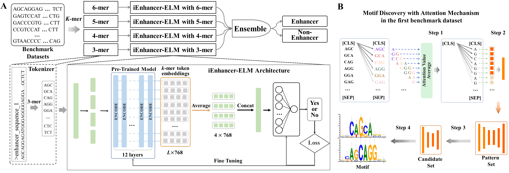
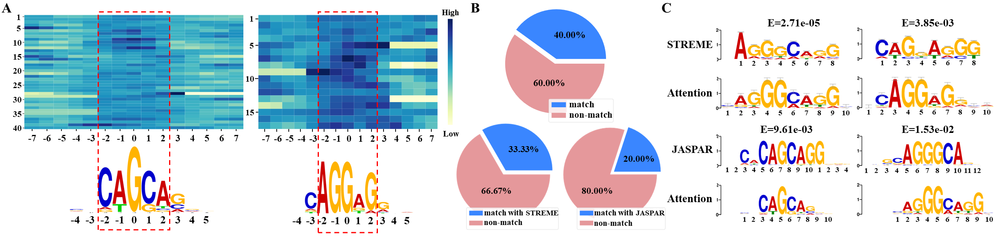

# iEnhancer-ELM
📋 iEnhancer-ELM: Learning Explainable Contextual Information to Improve Enhancer Identification using Enhancer Language Models

## Abstract
&nbsp;&nbsp;&nbsp;&nbsp; In this paper, we propose an enhancer language model **(iEnhancer-ELM)** for enhancer identification by incorporating a pre-trained BERT-based DNA model. iEnhancer-ELM treats enhancer sequences as natural sentences that are composed of k-mer nucleic acids to extract informative biological features from raw enhancer sequences. Benefiting from the complementary information in various k-mer (k=3,4,5,6) tokens, we ensemble four iEnhancer-ELM models for improving enhancer identification. The experimental results show that our model achieve an accuracy of **83.00%**, outperforming competing state-of-the-art methods. Moreover, **40%** of motifs found by iEnhancer-ELM can exhibit statistical and biological significance, demonstrating our model is explainable and has a potential ability to reveal the biological mechanism. 

## Contribution
&nbsp;&nbsp;&nbsp;&nbsp; Experiments on the benchmark dataset shows **iEnhancer-ELM with various k-mers achieves an accuracy of about **80%, outperforming all kind of well-known models with single feature**. We ensemble multiple iEnhancer-ELM models based on various k-mer tokens to achieve a better performance with accuracy of **83.00%**, outperforming existing state-of-the-art methods. Furthermore, we interpret the actions of iEnhancer-ELM by analyzing the patterns in attention mechanism. **We find the motifs extracted from the attention mechanism match existing motifs with significant level**, demonstrating the ability of iEnhancer-ELM capturing important biological features for enhancer identification. The contribution of this work can be summarized as follows:<br>
* We propose the enhancer language models by incorporating a pre-trained BERT-based DNA model to capture global contextual information from raw enhancer sequences.<br>
* Our iEnhancer-ELM achieves the best performance comparing with well-known models based on single feature, and the ensemble iEnhancer-ELM outperforms existing state-of-the-art methods.<br>
* iEnhancer-ELM has the ability to capture important biological motifs for enhancer identification, demonstrating its potentials for revealing the biological mechanism of enhancers.

## Model Structure
&nbsp;&nbsp;&nbsp;&nbsp; The following figure is the illustration of our proposed method. The top subfigure is the flowchart of enhancer identification, and the below subfigure is our motif analysis via the attention mechanism in iEnhancer-ELM with 3-mer. 

<div align=center></div>

## Result
### Performance comparison in the independent dataset of the first dataset
 
&nbsp;&nbsp;&nbsp;&nbsp; The below table shows the performance comparison in the independent dataset between ensemble iEnhancer-ELM and the state-of-the-art predictors for enhancer indefication.

| Method             | Acc     | Sn      | Sn      | MCC      | Source       |
| :-----------------:| :-----: | :-----: | :-----: | :-----:  | :----------: |
| iEnhancer-2L       | 0.7300  | 0.7100  | 0.7500  | 0.4600   | [Liu et al.](https://academic.oup.com/bioinformatics/article-abstract/32/3/362/1744331)  |
| iEnhancer-EL       | 0.7475  | 0.7100  | 0.7850  | 0.4960   | [Liu et al.](https://academic.oup.com/bioinformatics/article-abstract/34/22/3835/5034432) |
| iEnhancer-XG       | 0.7575  | 0.7400  | 0.7750  | 0.5140   | [Cai et sl.](https://academic.oup.com/bioinformatics/article-abstract/37/8/1060/5942971) |
| iEnhancer-Deep     | 0.7402  | 0.8150  | 0.6700  | 0.4902   | [Kamran et al.](https://www.mdpi.com/2076-3417/12/4/2120)|
| iEnhancer-GAN      | 0.7840  | 0.8110  | 0.7580  | 0.5670   | [Yang et al.](https://www.mdpi.com/1053580)|
| iEnhancer-5Step    | 0.7900  | **0.8200**  | 0.7600  | 0.5800   | [Le et al.](https://www.sciencedirect.com/science/article/pii/S0003269719300788?casa_token=rlafnb-27uYAAAAA:cbHTkKOhLg_iJdq4Ks7-3PiTaPO8lzpHGjIeHZqvizL2FLj6MtK8kgGN9XKa8Cfdq5HZ2Ez7dg)|
| BERT-Enhancer      | 0.7560  | 0.8000  | 0.7750  | 0.5150   | [Le et al.](https://academic.oup.com/bib/article-abstract/22/5/bbab005/6128847)|
| iEnhancer-ELM      | **0.8300**  | 0.8000  | **0.8600**  | **0.6612**   | **ours** |

### Moitf Analysis 
&nbsp;&nbsp;&nbsp;&nbsp;  Based on the method of motif analysis with attention mechanism[1], we extract motifs from the raw sequences according to the following steps. More details are shown in the main paper. 
* Step 1: calculate the attention weights of single nucleotide in enhancer sequences.
* Step 2: find out the potential patterns. 
* Step 3: filter significant candidates.
* Step 4: obtain motifs according to the sequence similarity.

&nbsp;&nbsp;&nbsp;&nbsp;  Finally, we can obtain 30 motifs, and make comparison with STREME[2] and JASPAR[3] by the tool of TomTom[4]. The result is shown in the below figure.

<div align=center></div>

### Performance comparison in the independent dataset of the second dataset
 
&nbsp;&nbsp;&nbsp;&nbsp; The below table shows the performance comparison in the independent dataset between ensemble iEnhancer-ELM and the state-of-the-art predictors for enhancer indefication.

| cell line     | method        |Bacc     |Sn       | Sn       | MCC      |AUC    | Source  |
| :------------:| :---------:   | :-----: | :-----: | :-----:  | :------: | :----:| :------:|
 <td rowspan="3">HEK293</td> | Enhancer-IF   |0.8170   | 0.7750  | 0.8580   | 0.6250   | 0.8930|    11     |
|              |non-fine-tuning|0.8278   | 0.8047  | 0.8509   | 0.6409   | 0.9114|    11     |
|              |fine-tuning    |0.8732   | 0.8666  | 0.8798   | 0.7283   | 0.9289|    11     |


## Code
### Enviromnent
```
# Clone this repository
git clone https://github.com/chen-bioinfo/iEnhancer-ELM.git
cd iEnhancer-ELM

# download the pre-trained BERT-based DNA models from the link (https://drive.google.com/drive/folders/1qzvCzYbx0UIZV3HY4pEEeIm3d_mqZRcb?usp=sharing);
# With these pre-trained models and the code file of iEnhancer-ELM/code/DNA_bert_finetuning_average_L2.ipynb, 
# we can reproduce the training process.

cd iEnhancer-ELM/code
# download the fine-trained classification models form the link (https://drive.google.com/drive/folders/1EdOYQ2BLcAUtS_dupWdmJ-v6bkne4xAM?usp=sharing);
# With these fine-trained modles and the code file of iEnhancer-ELM/code/DNA_Bert_finetuning_L2_ensemble.ipynb, 
# we can reproduce the best performance in independent dataset. And our motif analysis is based on these fine-trained models. 

# the key elements of 'iEnhancer-ELM' operating environment are listed below:
# python=3.6.9; Torch=1.9.0+cull 
# Numpy=1.19.5; Transformers=3.0.16
# GPU=NVIDIA A100 80GB PCIe

# the more details about code will been shown in the folder of 'code'.
```

## Reference 
[1] Ji Y, Zhou Z, Liu H, et al. DNABERT: pre-trained Bidirectional Encoder Representations from Transformers model for DNA-language in genome[J]. Bioinformatics, 2021, 37(15): 2112-2120.<br>
[2] Bailey T L. STREME: accurate and versatile sequence motif discovery[J]. Bioinformatics, 2021, 37(18): 2834-2840.<br>
[3] Castro-Mondragon J A, Riudavets-Puig R, Rauluseviciute I, et al. JASPAR 2022: the 9th release of the open-access database of transcription factor binding profiles[J]. Nucleic acids research, 2022, 50(D1): D165-D173.<br>
[4] Gupta S, Stamatoyannopoulos J A, Bailey T L, et al. Quantifying similarity between motifs[J]. Genome biology, 2007, 8(2): 1-9.<br>
